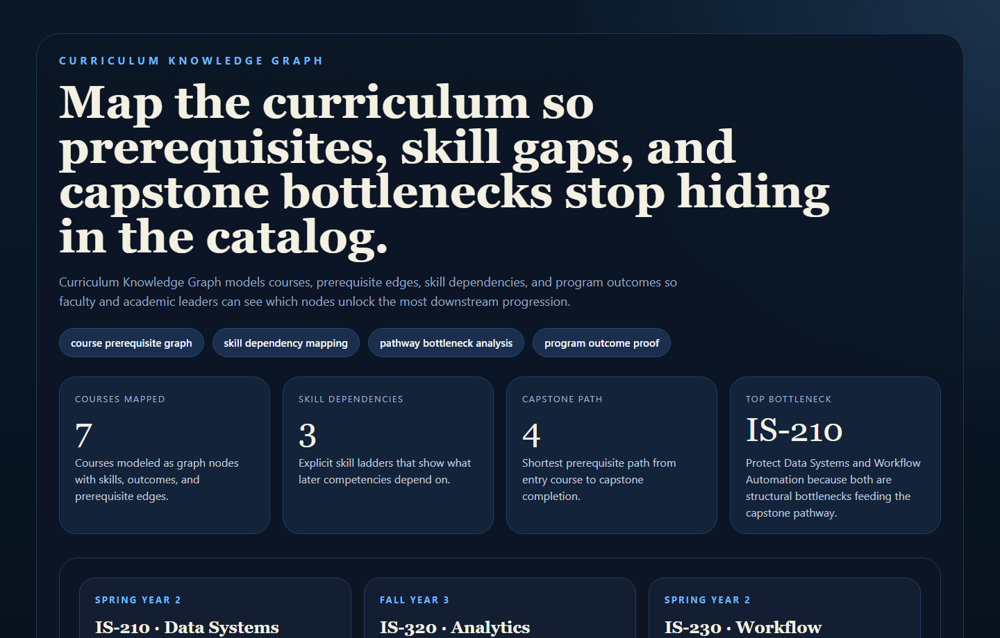
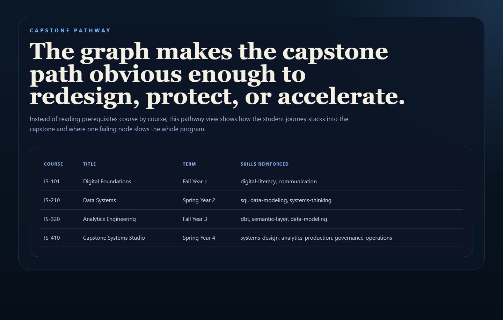
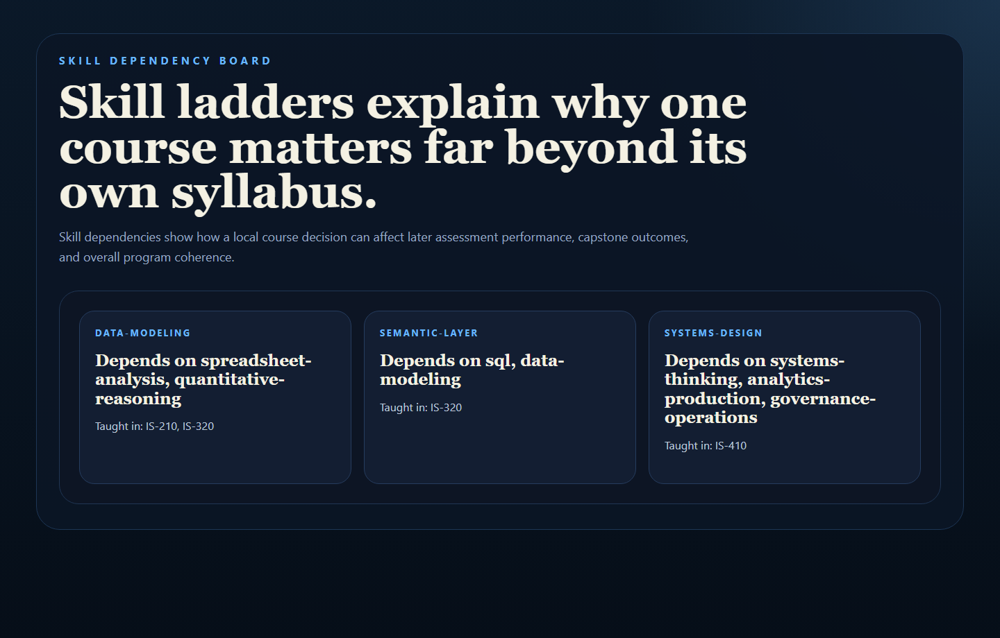
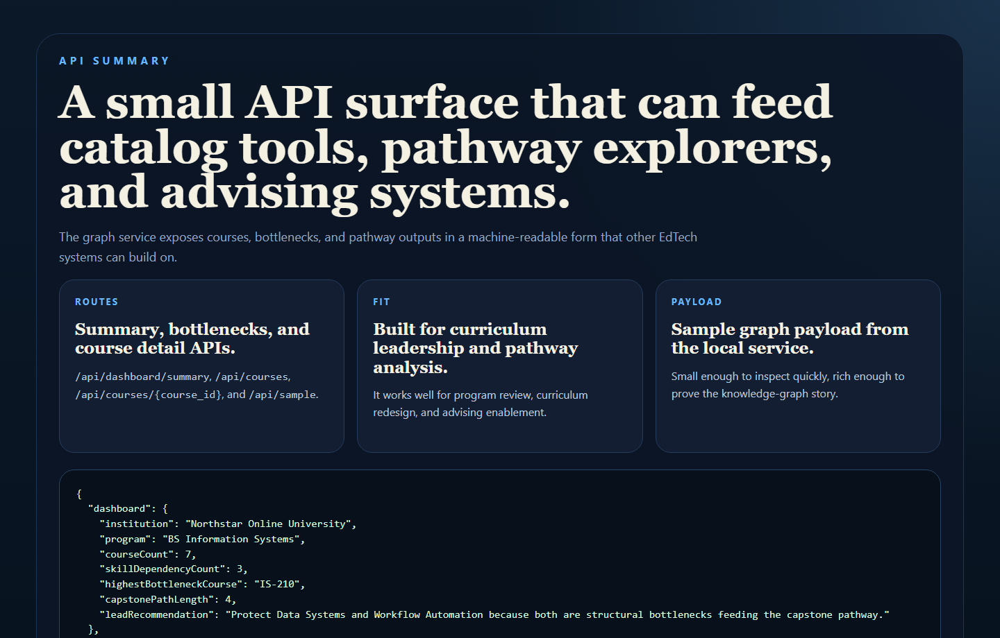

# Curriculum Knowledge Graph

Curriculum graph for courses, prerequisites, skills, outcomes, and pathway
bottleneck analysis in higher education.

## Why This Repo Is Good

- It expands the EdTech story beyond student risk into curriculum structure and learning pathways.
- It makes prerequisite bottlenecks and skill ladders visible instead of burying them in course catalogs.
- It gives academic leaders a more interesting artifact than another dashboard.
- It pairs naturally with `student-success-signal-hub`.

## What It Ships

- FastAPI curriculum graph service
- seeded degree-path dataset
- prerequisite and skill dependency analysis
- capstone pathway explorer
- real PNG screenshots generated from repo-owned proof pages
- tests and CI

## Screenshots

### Overview



### Capstone Pathway



### Skill Dependencies



### API Summary



## Local Run

```powershell
Set-Location "C:\Users\chaus\dev\repos\curriculum-knowledge-graph"
py -3.11 -m venv .venv
.\.venv\Scripts\python.exe -m pip install -r requirements.txt
.\.venv\Scripts\python.exe -m app.main
```

Open:

- [http://127.0.0.1:4706/](http://127.0.0.1:4706/)
- [http://127.0.0.1:4706/pathway](http://127.0.0.1:4706/pathway)
- [http://127.0.0.1:4706/skills](http://127.0.0.1:4706/skills)
- [http://127.0.0.1:4706/docs](http://127.0.0.1:4706/docs)

If that port is occupied:

```powershell
$env:PORT = "4710"
.\.venv\Scripts\python.exe -m app.main
```

## Validation

```powershell
Set-Location "C:\Users\chaus\dev\repos\curriculum-knowledge-graph"
.\.venv\Scripts\python.exe -m unittest discover -s tests
.\.venv\Scripts\python.exe scripts\run_demo.py
.\.venv\Scripts\python.exe scripts\smoke_check.py
.\.venv\Scripts\python.exe scripts\render_readme_assets.py
```

## Example Output

```json
{
  "dashboard": {
    "highestBottleneckCourse": "IS-230"
  },
  "capstonePath": ["IS-101", "IS-210", "IS-320", "IS-410"]
}
```

## Repo Layout

- `app/main.py`
- `app/services/graph_service.py`
- `app/data/sample_curriculum.json`
- `docs/architecture.md`
- `scripts/render_readme_assets.py`

## Why It Matters

Programs often know students are struggling before they know whether the
curriculum graph itself is creating hidden bottlenecks. This repo gives that
structural view back to faculty and academic operations teams.
